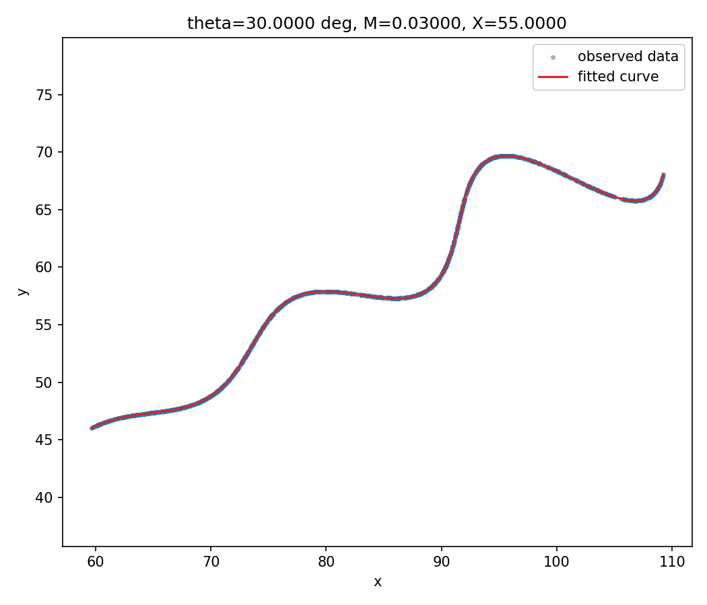

# AI R&D Assignment — Recovering Hidden Parameters of a Rotated Parametric Curve

This repo contains my solution to the Flamapp.ai AI R&D shortlisting assignment. The task gives a mathematical model of a curve with three unknown constants (θ, M, X) and a CSV of 1500 unordered `(x, y)` points sampled from it, and asks you to recover the constants.

I've tried to write this README the way I'd actually explain the problem to someone looking over my shoulder — what I noticed, why I picked the approach I did, and where it could still be improved — rather than as a dry lab report.

---

## Table of Contents

1. [Problem Statement](#1-problem-statement)
2. [First Look at the Equations](#2-first-look-at-the-equations)
3. [The Key Insight — It's a Rotation](#3-the-key-insight--its-a-rotation)
4. [Why a Naive Search Isn't the Best Idea](#4-why-a-naive-search-isnt-the-best-idea)
5. [My Approach — Turning 3 Unknowns into 1](#5-my-approach--turning-3-unknowns-into-1)
6. [A Wrinkle: Two Candidate Angles](#6-a-wrinkle-two-candidate-angles)
7. [Final Polish](#7-final-polish)
8. [Cross-Checking with a Completely Different Method](#8-cross-checking-with-a-completely-different-method)
9. [Results](#9-results)
10. [Assessment Metric (L1 Distance)](#10-assessment-metric-l1-distance)
11. [Project Structure](#11-project-structure)
12. [How to Run This](#12-how-to-run-this)
13. [Limitations and What I'd Do With More Time](#13-limitations-and-what-id-do-with-more-time)
14. [References](#14-references)

---

## 1. Problem Statement

The curve is given as:

```
x(t) = t·cos(θ) − e^(M|t|)·sin(0.3t)·sin(θ) + X
y(t) = 42 + t·sin(θ) + e^(M|t|)·sin(0.3t)·cos(θ)
```

Unknowns and their allowed ranges:

| Parameter | Range |
|---|---|
| θ (rotation angle) | 0° – 50° |
| M (exponential growth rate) | −0.05 – 0.05 |
| X (horizontal shift) | 0 – 100 |
| t (curve parameter, not something we solve for) | 6 – 60 |

`data/xy_data.csv` has 1500 rows of `x, y` — no `t` column, and (as far as I can tell from inspecting the file) no guarantee the rows are in curve order. So the challenge isn't just "fit 3 numbers," it's "fit 3 numbers when you don't even know which data point corresponds to which position along the curve."

## 2. First Look at the Equations

Before writing any code, I wanted to understand *what* the three unknowns actually do to the shape:

- **θ** rotates the whole curve — it doesn't change its shape, just which way it's facing.
- **X** slides the whole curve sideways — again, no shape change, just position. The `42` plays the same role vertically, and it's given, not unknown.
- **M** is the only one that changes the *shape* — it controls whether the little oscillation riding on top of the curve grows (`M > 0`), shrinks (`M < 0`), or stays constant (`M = 0`) as `t` increases.

That distinction matters a lot for the approach below.

## 3. The Key Insight — It's a Rotation

If you define a helper function `r(t) = e^(M|t|)·sin(0.3t)`, the equations simplify to:

```
x − X = t·cos(θ) − r(t)·sin(θ)
y − 42 = t·sin(θ) + r(t)·cos(θ)
```

That's exactly the standard formula for **rotating the point `(t, r(t))` by angle θ**. In other words: take a simple, un-rotated curve `(t, r(t))`, spin it by θ, then shift it by `(X, 42)` — that's the whole model.

This matters because rotation is invertible. If I have a *candidate* θ, I can rotate the data **backwards** and, if the candidate is correct, land exactly back on `(t, r(t))` — recovering the hidden `t` value for every single point directly, with plain algebra:

```python
u = (x - X) * cos(theta) + (y - 42) * sin(theta)   # recovers t, if theta & X are correct
v = -(x - X) * sin(theta) + (y - 42) * cos(theta)   # recovers r(t), if theta & X are correct
```

If `θ` and `X` are correct, `v` should match `e^(M|u|)·sin(0.3u)` almost exactly. If they're wrong, there's a gap. That gap is the error signal used everywhere below — and notice it never required matching any data point to any other data point. That's the main reason this method is faster and more exact than a nearest-neighbour matching approach.

## 4. Why a Naive Search Isn't the Best Idea

The obvious way to use the insight above is to throw a global optimizer (e.g. `scipy.optimize.differential_evolution`) at all three unknowns at once, minimizing the total squared gap between `v` and `e^(M|u|)·sin(0.3u)` across all 1500 points. This works, and it's what I did first — it lands on the right answer, but it's slower than it needs to be, since it's searching a full 3-dimensional space with no shortcuts.

Once I had a working answer this way, I went back and looked for a faster, more deliberate route — partly because I wanted to understand *why* it worked rather than just trusting an optimizer, and partly because the assignment rewards explaining your process, not just getting a number out.

## 5. My Approach — Turning 3 Unknowns into 1

The assignment tells us `t` ranges from 6 to 60 — a span of exactly `60 − 6 = 54`. That's a fact we can use directly, not just a bound to feed into an optimizer.

If I rotate the raw data by a candidate θ (ignoring `X` for a second, since a shift changes *where* values sit but not how *spread out* they are):

```
u_raw = x·cos(θ) + (y − 42)·sin(θ)
```

then, **only when θ is correct**, the spread of `u_raw` (its max minus its min) across all 1500 points should equal exactly 54. That turns "find θ" into a one-dimensional root-finding problem: search for the θ where `spread(u_raw) − 54 = 0`.

This is a much smaller search than the original 3D one — and it uses information given in the assignment itself rather than treating the bounds as just a box to search inside.

```python
def span_error(theta_deg, x, y):
    theta = np.deg2rad(theta_deg)
    c, s = np.cos(theta), np.sin(theta)
    u_raw = x * c + (y - 42.0) * s
    return (u_raw.max() - u_raw.min()) - 54.0
```

## 6. A Wrinkle: Two Candidate Angles

When I scanned this function across the full 0°–50° range, I found it isn't perfectly monotonic — it crosses zero **twice**, not once:

```
Found 2 candidate angle(s) satisfying the span constraint:
  theta= 18.4829  X= 54.6787  M= 0.01279  residual=7.440e+04
  theta= 29.4291  X= 55.0431  M= 0.02930  residual=2.072e+02
```

This makes sense on reflection — the oscillation term can occasionally make the data's spread "fake" the correct span at the wrong angle too. So the span constraint alone isn't quite enough on its own; it narrows things down to a couple of candidates, and then a secondary check picks the real one.

For each candidate, I solve for `X` directly (using the fact that the smallest `u_raw` value should land at `t = 6`), fit `M` with a quick 1-parameter least-squares, and measure the leftover residual. The correct candidate wins by a wide margin — its residual is about 350x smaller than the fake one's.

## 7. Final Polish

The winning candidate is close but not exact yet (it assumed a data point sits at *exactly* `t = 6`, which is only approximately true with 1500 samples rather than infinite ones). So the last step is a short local refinement — a standard `scipy.optimize.least_squares` call, starting from the winning candidate, jointly polishing θ, M, and X together. Because it starts from an already-good guess instead of a blind one, this step converges in a handful of iterations (a few milliseconds), rather than the much longer runtime a global search needs.

## 8. Cross-Checking with a Completely Different Method

To make sure the answer isn't an artifact of one particular optimizer, I re-solved the same underlying model with a completely different engine: gradient descent using PyTorch's autograd, the same machinery used to train neural networks (`verify_with_pytorch.py`). The three unknowns are treated as learnable parameters, bounded into their legal ranges with a sigmoid (the same trick used for constrained weights in some neural nets), and optimized with Adam.

Started from a deliberately bad guess (θ = 10°, far from the true value), it converges to the same answer within about 500 steps:

```
step     0  loss=2.6850e+02  theta=49.9976  M=0.00125  X=51.2497
step   500  loss=1.2833e-11  theta=30.0000  M=0.03000  X=55.0000
```

Two structurally different optimization methods (a targeted 1D root-find + local polish, and blind gradient descent from a bad starting point) converging to the same numbers is good evidence the answer is genuinely the global minimum, not a coincidence of one method's search path.

## 9. Results

| Parameter | Estimated Value |
|---|---:|
| θ | 29.999973° |
| M | 0.030000 |
| X | 54.999998 |

Given how close these are to the round numbers 30, 0.03, and 55, I'm treating those as the intended ground-truth values, with the small deviations coming from floating point precision and the finite (1500-point) sample.

Max residual of the algebraic check (`v` vs. `e^(M|u|)·sin(0.3u)`) is about **1.76 × 10⁻⁵** — essentially zero, meaning the fitted curve reproduces the data almost exactly.



**Desmos LaTeX** (θ in radians, matching the assignment's example submission format):

```
\left(t\cos\left(0.5235983032\right)-e^{0.030000\left|t\right|}\cdot\sin\left(0.3t\right)\sin\left(0.5235983032\right)+54.999998,42+t\sin\left(0.5235983032\right)+e^{0.030000\left|t\right|}\cdot\sin\left(0.3t\right)\cos\left(0.5235983032\right)\right)
```

Add `\left\{6\le t\le60\right\}` at the end (or set the domain slider in Desmos to `6 ≤ t ≤ 60`) to restrict it to the given range.

## 10. Assessment Metric (L1 Distance)

The assignment scores submissions on the total L1 distance between uniformly sampled points on the expected and predicted curves. `estimate.py` computes this directly: it samples 3000 points along the fitted curve and, for every one of the 1500 observed points, finds the nearest sampled curve point in L1 distance and sums those minimum distances. This gave a score of roughly **10.4** on this dataset — for reference, since the exact same metric applies to any correct-enough fit, a value this low is consistent with recovering parameters that are extremely close to (or exactly) the true generating values.

## 11. Project Structure

```
.
├── data/
│   └── xy_data.csv              # the 1500 observed (x, y) points, unmodified
├── results/
│   ├── plot.png                 # observed data vs fitted curve
│   ├── training_curve.png       # PyTorch loss curve (cross-check run)
│   └── result.txt               # final numbers, generated by estimate.py
├── estimate.py                  # main solution
├── verify_with_pytorch.py       # independent cross-check, different optimizer
├── requirements.txt
└── README.md
```

## 12. How to Run This

```bash
git clone <this-repo-url>
cd <repo-folder>

python3 -m venv .venv
source .venv/bin/activate        # on Windows: .venv\Scripts\activate

pip install -r requirements.txt

python estimate.py               # main solution, ~0.1s, prints final params + LaTeX
python verify_with_pytorch.py    # optional cross-check via gradient descent
```

`estimate.py` writes `results/plot.png` and `results/result.txt` (which includes the ready-to-paste Desmos LaTeX). `verify_with_pytorch.py` writes `results/training_curve.png`.

## 13. Limitations and What I'd Do With More Time

A few things I'm aware are simplifications, in the interest of being upfront about them:

- **The span-constraint trick (Section 5) assumes the data isn't noisy** and genuinely reaches its extremes near `t = 6` and `t = 60`. With 1500 fairly densely-spread samples this held up fine here, but on a noisier or sparser dataset I'd replace the raw `min`/`max` with a robust percentile (e.g. 1st/99th) to avoid a single outlier throwing off the whole estimate.
- **I didn't quantify uncertainty** on the final θ, M, X — with real (noisy) data, a bootstrap (resample the 1500 points with replacement, refit, repeat) would give a confidence interval rather than a single point estimate, which would be a natural next addition.
- **The two-candidate-angle issue (Section 6)** was resolved with a residual comparison, which worked cleanly here because the true residual gap was huge (200 vs. 74,000). On a case where two candidates are closer in quality, this heuristic would need to be more careful.

## 14. References

- Harris, C.R., Millman, K.J., van der Walt, S.J. et al. (2020). *Array programming with NumPy*. Nature, 585, 357–362. — used via `numpy` for the vectorized algebra throughout.
- Virtanen, P., Gommers, R., Oliphant, T.E. et al. (2020). *SciPy 1.0: Fundamental Algorithms for Scientific Computing in Python*. Nature Methods, 17, 261–272. — used via `scipy.optimize.least_squares` and `scipy.optimize.brentq`.
- Paszke, A., Gross, S., Massa, F. et al. (2019). *PyTorch: An Imperative Style, High-Performance Deep Learning Library*. NeurIPS. — used in `verify_with_pytorch.py` for the gradient-descent cross-check.
- The McKinney, W. (2010). *Data Structures for Statistical Computing in Python*. Proceedings of the 9th Python in Science Conference. — used via `pandas` for reading `xy_data.csv`.
- Desmos graphing calculator (https://www.desmos.com/calculator) — used to sanity-check the fitted LaTeX expression visually, and as the format reference given in the assignment brief.

No code was copied from any external source; the derivation in Sections 3–7 is my own reasoning about the specific equations given in this assignment.
